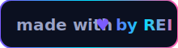

<!-- markdownlint-disable MD033 MD041 -->
<p align="center">
  <a href="https://github.com/edrez1/Greatest-Bot-Of-All-Time-2026">
    
  </a>
</p>

<h1 align="center">
  Greatest&nbsp;Bot&nbsp;Of&nbsp;All&nbsp;Time&nbsp;·&nbsp;2026
</h1>

<p align="center">
  <em>A persistent, beautiful, casino-grade Facebook&nbsp;Messenger bot. Crafted by <strong>Rei</strong>.</em>
</p>

<p align="center">
  
  
  
  
</p>

<p align="center">
  <a href="https://render.com/deploy?repo=https://github.com/edrez1/Greatest-Bot-Of-All-Time-2026">
    
  </a>
  &nbsp;
  <a href="https://railway.app/new/template?template=https://github.com/edrez1/Greatest-Bot-Of-All-Time-2026">
    
  </a>
</p>

---

## Why this fork?

> The original Goat-Bot-V2 is great. **This** one is great _and_ playable.
> Drop-in replacement: same command authoring API, same database, same dashboard
> shell — but with a brand-new economy, eight working casino games, an aesthetic
> live status page, and a one-click in-browser setup that needs **zero**
> environment variables.

## Highlights

| | |
|---|---|
| 🎰 | **Eight working casino games** — slot (with ⭐ scatter), blackjack, dice, coinflip, RPS, roulette, lottery, mines |
| 🏆 | **`/top` leaderboard** — top 10/25 richest players with medals, plus your own rank |
| 🎨 | **`/canvas` art** — generates a custom card image (avatar + level + balance) on demand |
| 💾 | **Forever-persistent records** — SQLite by default; user money, stats and ranks survive every restart, crash and redeploy |
| ✨ | **Aesthetic status page** at `/` — animated rainbow ticker, live JSON stats, conic-gradient logo, zero JS framework |
| 🔐 | **In-browser appstate setup** at `/setup` — paste the JSON, click one button, the bot starts. No env vars needed. |
| 🚀 | **One-click deploy** — `render.yaml`, `railway.json`, `nixpacks.toml`, `Procfile` all included and pre-tested |
| 🌐 | **Multilingual core** — English + Vietnamese language packs, per-thread switching |

---

## Quick start (the no-env path)

1. Click one of the deploy buttons above (or `git push` your fork to any Node host).
2. When the build finishes, open the deployed URL — you'll see the live status page.
3. Click **Setup** in the top-right.
4. Paste your Facebook **appstate** JSON (any "appstate grabber" / `c3c-fbstate` browser extension exports it in one click).
5. Hit **Save & launch bot**.
6. The bot is online. The status page now shows ✅ Bot online with command count, uptime, memory and your UID.

> That's it. No `.env`, no SSH, no shell. The setup screen writes `account.txt` for you and spawns the bot in the same process.

## Quick start (the env-var path, for CI)

Set any of these on your host before first boot — the bot will pick them up and never show the setup wall:

| Variable | Required? | Purpose |
|---|---|---|
| `APPSTATE` | _yes (or paste in /setup)_ | Raw JSON of the FB cookie array |
| `APPSTATE_BASE64` | _alt to APPSTATE_ | Same, base64-encoded (for hosts that mangle JSON) |
| `BOT_PREFIX` | no | Command prefix, default `/` |
| `BOT_NICKNAME` | no | Display name, default `Goat Bot` |
| `ADMIN_UIDS` | no | Comma- or space-separated FB UIDs that get admin role |
| `FB_EMAIL` / `FB_PASSWORD` / `FB_2FA` | no | Used by the auto cookie-refresh loop |
| `MONGODB_URI` | no | If set, switches `database.type` to `mongodb` |
| `PORT` | injected | Render/Railway provide this; the dashboard binds to it |

Full reference lives in [`.env.example`](./.env.example).

---

## Command reference

> All games use `usersData.get/set` so balances persist in SQLite **forever**.

### Economy & games

| Command | Aliases | What it does |
|---|---|---|
| `/slot <bet>` | `slots`, `scatter` | Slot machine with ⭐ scatter bonuses up to **x100** |
| `/blackjack <bet>` | `bj` | Full blackjack vs dealer — hit / stand / double |
| `/dice <high\|low\|7> <bet>` | `roll` | Two-dice prediction; **3x** payout on a clean 7 |
| `/coinflip <head\|tail> <bet>` | `cf`, `flip` | Classic double-or-nothing |
| `/rps <choice> <bet>` | `rockpaperscissors` | Rock-Paper-Scissors with **1.8x** payout |
| `/roulette <colour\|even\|odd\|0-36> <bet>` | `rl` | European roulette, **35x** on a single number |
| `/lottery buy [n]` | `lotto` | Buy tickets, admin draws — full pool payout |
| `/mines <bet> [mines]` | `mine` | 5×5 minefield, dynamic multiplier, cash-out anytime |
| `/canvas [@tag\|reply]` | `card` | Renders an aesthetic card image (avatar + stats) |
| `/top [n]` | `rich`, `richest`, `leaderboard`, `lb` | Top 10 (or up to 25) richest players + **your own rank** |
| `/balance` | `bal` | View your money or a tagged user's |
| `/daily` | — | Daily reward for the economy |

Plus 80+ inherited commands (rank cards, music search, AI, moderation, group tools, weather, translation, …) — see [`scripts/cmds/`](./scripts/cmds/).

---

## Architecture

```text
start.js                         ← zero-config bootstrap (env → files → dashboard → bot)
index.js → Goat.js               ← original supervisor (config validate, login)
bot/login/login.js               ← FB session + DB warm-up
dashboard/app.js                 ← Express: /, /setup, /api/stats, /api/appstate
dashboard/views/status.html      ← live status page (animated)
dashboard/views/setup.html       ← in-browser appstate paste-and-launch
scripts/cmds/                    ← all commands (each ≈ 1 small file)
scripts/events/                  ← welcome / leave / log / antichange / …
database/                        ← SQLite + MongoDB controllers + models
languages/                       ← en.lang + vi.lang
render.yaml · railway.json · nixpacks.toml · Procfile
```

The dashboard always binds first so the platform's health check passes.
The bot is launched inside the same process — either immediately (if an
appstate is already on disk) or the moment one is posted to `/api/appstate`.
If the bot child exits, the dashboard stays up so you can re-paste a fresh
appstate without a redeploy.

---

## Public HTTP endpoints

| Path | Method | Purpose |
|---|---|---|
| `/` | GET | Aesthetic landing / status page |
| `/setup` | GET | In-browser appstate setup form |
| `/api/stats` | GET | Live JSON: uptime, commands, users, threads, appstate, memory |
| `/api/setup-status` | GET | Just the setup-related fields |
| `/api/appstate` | POST | `{ "appstate": "<JSON or base64>" }` → writes `account.txt` and spawns the bot |
| `/api/appstate/clear` | POST | Wipe `account.txt` |
| `/health` | GET | `{ "status": "ok" }` for platform health checks |
| `/uptime` | GET | Plain `OK` for uptime monitors |

---

## Local dev

```bash
npm install
node start.js          # boots dashboard + bot in one process
# open http://localhost:3001  →  /setup to paste your appstate
```

`canvas` and `node-canvas` need cairo/pango/librsvg. The included
`nixpacks.toml` already declares them for Render and Railway. On macOS use
`brew install pkg-config cairo pango libpng jpeg giflib librsvg`. On Debian/
Ubuntu use `apt install libcairo2-dev libpango1.0-dev libjpeg-dev libgif-dev librsvg2-dev`.

---

## Security notes

- **Never paste tokens in chat.** Use your host's secret manager or the in-browser `/setup` page.
- `account.txt`, `config.dev.json`, `*.log`, and every `.env*` file are git-ignored — the appstate stays on the server.
- `/api/appstate` accepts plain JSON _or_ base64. It refuses anything that isn't a non-empty array of `{key,value}` cookies.
- Wipe a stored session at any time with the **Wipe session** button on `/setup` (or `POST /api/appstate/clear`).

---

## Credits

Forked, hardened and re-themed by **Rei** for the
[`Greatest-Bot-Of-All-Time-2026`](https://github.com/edrez1/Greatest-Bot-Of-All-Time-2026) repo.
Original Goat-Bot-V2 framework © NTKhang — MIT.
This fork is also **MIT** licensed.

<p align="center">
  
</p>
